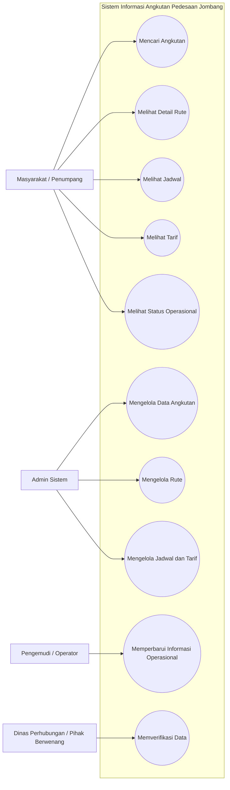
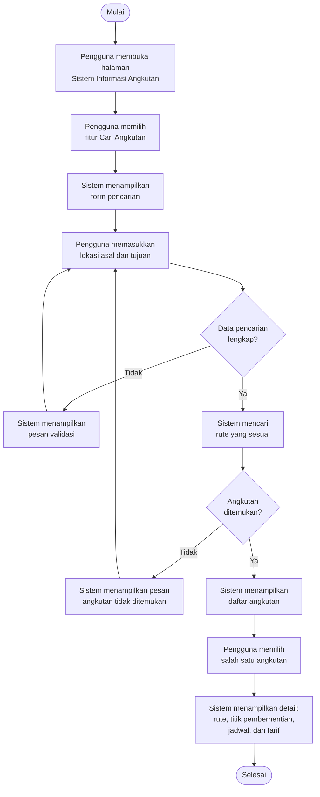

# DOKUMEN KEBUTUHAN SISTEM

SISTEM INFORMASI ANGKUTAN PEDESAAN JOMBANG (ROMBONGIN)

## SISTEM INFORMASI ANGKUTAN PEDESAAN JOMBANG

Mata Kuliah: Pemrograman Web Lanjut
Program Studi: Teknik Informatika
Semester: 5
Jenis Sistem: Aplikasi Web
Teknologi Rencana Implementasi: Laravel + MySQL

# DOKUMEN KEBUTUHAN SISTEM

## SISTEM INFORMASI ANGKUTAN PEDESAAN JOMBANG

**Mata Kuliah:** Pemrograman Web Lanjut
**Program Studi:** Teknik Informatika
**Semester:** 5
**Jenis Sistem:** Aplikasi Web
**Teknologi Rencana Implementasi:** Laravel + MySQL

## 1. Pendahuluan

### 1.1 Latar Belakang

Transportasi angkutan pedesaan merupakan salah satu sarana transportasi yang membantu masyarakat dalam melakukan mobilitas antarwilayah, khususnya bagi masyarakat yang tinggal di daerah pedesaan. Namun, informasi mengenai angkutan pedesaan seperti rute, jadwal operasional, tarif, dan titik pemberhentian belum selalu mudah ditemukan oleh masyarakat dalam satu sumber informasi yang terpusat.

Kondisi tersebut dapat menyebabkan masyarakat mengalami kesulitan dalam menentukan angkutan yang sesuai dengan tujuan perjalanan. Selain itu, informasi mengenai perubahan rute, tarif, maupun status operasional dapat menjadi kurang efektif apabila penyebarannya masih dilakukan secara terbatas.

Berdasarkan permasalahan tersebut, dikembangkan **Sistem Informasi Angkutan Pedesaan Jombang**, yaitu sistem berbasis web yang menyediakan informasi mengenai angkutan pedesaan di Kabupaten Jombang. Sistem ini diharapkan dapat membantu masyarakat memperoleh informasi transportasi secara lebih mudah, sekaligus membantu pihak pengelola dalam mengelola dan memperbarui data angkutan.

### 1.2 Tujuan Sistem

Sistem ini bertujuan untuk:

1. Menyediakan informasi angkutan pedesaan di Kabupaten Jombang secara terpusat.
2. Memudahkan masyarakat mencari angkutan berdasarkan wilayah asal dan tujuan.
3. Menyediakan informasi rute dan titik pemberhentian angkutan.
4. Menyediakan informasi jadwal dan tarif angkutan.
5. Membantu admin dalam mengelola data angkutan.
6. Membantu pihak berwenang melakukan verifikasi terhadap informasi angkutan.
7. Meningkatkan kemudahan masyarakat dalam memperoleh informasi transportasi pedesaan.

### 1.3 Ruang Lingkup Sistem

Sistem mencakup pengelolaan dan penyediaan informasi mengenai:

* Data angkutan pedesaan.
* Rute perjalanan.
* Titik pemberhentian.
* Jadwal operasional.
* Tarif angkutan.
* Status operasional.
* Informasi perubahan data.
* Verifikasi data oleh pihak berwenang.

Sistem berbasis web dan dapat diakses melalui browser pada perangkat desktop maupun smartphone.

# 2. Identifikasi Aktor

Sistem memiliki empat aktor utama.

| No. | Aktor                                 | Peran                                                                                       |
| --- | ------------------------------------- | ------------------------------------------------------------------------------------------- |
| 1   | **Masyarakat/Penumpang**              | Mengakses dan mencari informasi angkutan pedesaan berdasarkan kebutuhan perjalanan.         |
| 2   | **Pengemudi/Operator Angkutan**       | Memberikan atau memperbarui informasi terkait kondisi operasional angkutan yang dikelola.   |
| 3   | **Admin Sistem**                      | Mengelola data angkutan, rute, jadwal, tarif, dan data lainnya dalam sistem.                |
| 4   | **Dinas Perhubungan/Pihak Berwenang** | Melakukan verifikasi dan pengawasan terhadap informasi angkutan yang dikelola dalam sistem. |

# 3. Kebutuhan Fungsional

Kebutuhan fungsional menjelaskan fungsi yang **harus dapat dilakukan oleh sistem**.

| ID       | Kebutuhan Fungsional                                                                                                                        | Aktor                             |
| -------- | ------------------------------------------------------------------------------------------------------------------------------------------- | --------------------------------- |
| **F-01** | Sistem harus menyediakan fitur pencarian angkutan berdasarkan wilayah asal dan tujuan.                                                      | Masyarakat/Penumpang              |
| **F-02** | Sistem harus menampilkan informasi detail rute angkutan yang meliputi asal, tujuan, jalur yang dilewati, dan titik pemberhentian.           | Masyarakat/Penumpang              |
| **F-03** | Sistem harus menyediakan informasi jadwal operasional berdasarkan rute angkutan yang dipilih.                                               | Masyarakat/Penumpang              |
| **F-04** | Sistem harus menampilkan informasi tarif berdasarkan rute angkutan yang dipilih.                                                            | Masyarakat/Penumpang              |
| **F-05** | Sistem harus menampilkan status operasional angkutan, seperti aktif, tidak aktif, atau mengalami perubahan operasional.                     | Masyarakat/Penumpang              |
| **F-06** | Sistem harus memungkinkan Admin menambah, melihat, mengubah, dan menghapus data angkutan.                                                   | Admin                             |
| **F-07** | Sistem harus memungkinkan Admin mengelola data rute, titik pemberhentian, jadwal, dan tarif angkutan.                                       | Admin                             |
| **F-08** | Sistem harus memungkinkan pihak berwenang melakukan verifikasi terhadap perubahan data angkutan sebelum data ditampilkan kepada masyarakat. | Dinas Perhubungan/Pihak Berwenang |

### 3.1 Penjelasan Kebutuhan Fungsional

#### F-01 - Pencarian Angkutan

Sistem menyediakan fitur pencarian berdasarkan **wilayah asal dan wilayah tujuan**. Setelah pengguna melakukan pencarian, sistem menampilkan angkutan yang memiliki rute yang sesuai.

#### F-02 - Informasi Detail Rute

Sistem menampilkan detail rute yang dipilih pengguna, termasuk lokasi asal, lokasi tujuan, jalur yang dilewati, dan titik pemberhentian.

#### F-03 - Informasi Jadwal

Sistem menampilkan jadwal operasional angkutan berdasarkan rute tertentu sehingga pengguna dapat mengetahui waktu operasional angkutan.

#### F-04 - Informasi Tarif

Sistem menampilkan tarif yang berlaku pada rute angkutan yang dipilih.

#### F-05 - Status Operasional

Sistem memberikan informasi mengenai status angkutan sehingga pengguna dapat mengetahui apakah suatu angkutan masih beroperasi.

#### F-06 - Pengelolaan Data Angkutan

Admin dapat melakukan operasi **CRUD (Create, Read, Update, Delete)** terhadap data angkutan.

#### F-07 - Pengelolaan Informasi Rute

Admin dapat mengelola informasi yang berhubungan dengan rute, titik pemberhentian, jadwal, dan tarif.

#### F-08 - Verifikasi Data

Pihak berwenang dapat melakukan pemeriksaan terhadap perubahan informasi sebelum informasi tersebut dipublikasikan kepada masyarakat.

# 4. Kebutuhan Nonfungsional

Kebutuhan nonfungsional menjelaskan kualitas dan batas performa sistem.

| ID        | Kategori     | Kebutuhan                                                                                               | Indikator/Ukuran                                                                                                                                |
| --------- | ------------ | ------------------------------------------------------------------------------------------------------- | ----------------------------------------------------------------------------------------------------------------------------------------------- |
| **NF-01** | Performance  | Sistem harus memberikan respons terhadap permintaan pengguna dengan cepat pada kondisi jaringan normal. | Waktu respons halaman utama maksimal **3 detik**.                                                                                               |
| **NF-02** | Availability | Sistem harus dapat diakses oleh pengguna di luar waktu pemeliharaan.                                    | Target ketersediaan sistem minimal **95% per bulan**.                                                                                           |
| **NF-03** | Security     | Sistem harus membatasi akses terhadap fitur pengelolaan data berdasarkan hak akses pengguna.            | Pengguna tanpa hak akses tidak dapat mengakses fungsi administrasi dan sistem menampilkan **403 Forbidden/akses ditolak**.                      |
| **NF-04** | Usability    | Sistem harus dapat digunakan pada perangkat desktop dan smartphone.                                     | Tampilan responsive dan fitur utama dapat digunakan tanpa komponen antarmuka bertumpuk/terpotong pada ukuran layar umum desktop dan smartphone. |

# 5. Batasan Sistem

Untuk menjaga ruang lingkup proyek agar tetap realistis, sistem memiliki batasan sebagai berikut:

### B-01 - Tidak Menyediakan Pemesanan

Sistem **tidak menyediakan fitur pemesanan atau pembelian tiket angkutan secara online**. Sistem hanya menyediakan informasi mengenai angkutan pedesaan.

### B-02 - Tidak Menyediakan Pelacakan GPS Real-Time

Sistem **tidak menyediakan pelacakan posisi kendaraan secara real-time menggunakan GPS**.

### B-03 - Wilayah Operasional Terbatas

Sistem hanya berfokus pada informasi angkutan pedesaan yang beroperasi di **wilayah Kabupaten Jombang**.

### B-04 - Ketergantungan terhadap Data

Keakuratan informasi yang ditampilkan bergantung pada data yang diberikan, diperbarui, dan diverifikasi oleh pihak pengelola atau pihak berwenang.

# 6. User Story

## US-01 - Mencari Angkutan

**Sebagai masyarakat/penumpang, saya ingin mencari angkutan berdasarkan lokasi asal dan tujuan agar saya dapat mengetahui angkutan yang sesuai dengan perjalanan saya.**

### Acceptance Criteria

1. Pengguna dapat memasukkan wilayah asal.
2. Pengguna dapat memasukkan wilayah tujuan.
3. Sistem menampilkan daftar angkutan yang sesuai dengan asal dan tujuan.
4. Sistem menampilkan informasi apabila tidak terdapat angkutan yang sesuai.

## US-02 - Melihat Detail Rute

**Sebagai masyarakat/penumpang, saya ingin melihat detail rute angkutan agar saya mengetahui jalur dan titik pemberhentian yang dilewati.**

### Acceptance Criteria

1. Pengguna dapat memilih angkutan dari hasil pencarian.
2. Sistem menampilkan wilayah asal dan tujuan angkutan.
3. Sistem menampilkan jalur yang dilewati angkutan.
4. Sistem menampilkan titik pemberhentian yang tersedia.

## US-03 - Mengelola Data Angkutan

**Sebagai Admin, saya ingin mengelola data angkutan agar informasi yang tersedia bagi masyarakat tetap terbarui.**

### Acceptance Criteria

1. Admin dapat menambahkan data angkutan baru.
2. Admin dapat mengubah data angkutan yang sudah tersedia.
3. Admin dapat menghapus data angkutan.
4. Sistem melakukan validasi terhadap data sebelum data disimpan.

## US-04 - Memverifikasi Data Angkutan

**Sebagai pihak berwenang, saya ingin memverifikasi perubahan data angkutan agar informasi yang ditampilkan kepada masyarakat dapat dipercaya.**

### Acceptance Criteria

1. Pihak berwenang dapat melihat data yang menunggu verifikasi.
2. Pihak berwenang dapat menyetujui data.
3. Pihak berwenang dapat menolak data.
4. Sistem menyimpan status verifikasi setiap data.

# 7. Use Case Naratif

## UC-01 - Mencari Angkutan Berdasarkan Asal dan Tujuan

| Komponen          | Keterangan                                                                                 |
| ----------------- | ------------------------------------------------------------------------------------------ |
| **Use Case ID**   | UC-01                                                                                      |
| **Nama Use Case** | Mencari Angkutan                                                                           |
| **Aktor Utama**   | Masyarakat/Penumpang                                                                       |
| **Tujuan**        | Membantu pengguna menemukan angkutan yang sesuai dengan lokasi asal dan tujuan perjalanan. |
| **Pemicu**        | Pengguna ingin mencari informasi angkutan.                                                 |
| **Precondition**  | Sistem dapat diakses dan data angkutan tersedia dalam database.                            |
| **Postcondition** | Sistem menampilkan daftar angkutan yang sesuai dengan pencarian pengguna.                  |

### 7.1 Alur Utama

1. Pengguna membuka halaman utama Sistem Informasi Angkutan Pedesaan Jombang.
2. Pengguna memilih fitur **Cari Angkutan**.
3. Sistem menampilkan form pencarian.
4. Pengguna memasukkan lokasi asal.
5. Pengguna memasukkan lokasi tujuan.
6. Pengguna menekan tombol **Cari**.
7. Sistem melakukan validasi terhadap data pencarian.
8. Sistem mencari data rute yang sesuai dengan lokasi asal dan tujuan.
9. Sistem menampilkan daftar angkutan yang sesuai.
10. Pengguna memilih salah satu angkutan.
11. Sistem menampilkan detail angkutan, rute, titik pemberhentian, jadwal, dan tarif.

### 7.2 Alur Alternatif

**A1 - Data tidak ditemukan**

1. Pengguna memasukkan lokasi asal dan tujuan.
2. Sistem melakukan pencarian.
3. Sistem tidak menemukan angkutan yang sesuai.
4. Sistem menampilkan pesan:

> **"Angkutan dengan rute yang dipilih tidak ditemukan."**

5. Pengguna dapat melakukan pencarian kembali dengan lokasi yang berbeda.

**A2 - Data pencarian tidak lengkap**

1. Pengguna menekan tombol **Cari** tanpa mengisi salah satu lokasi.
2. Sistem melakukan validasi.
3. Sistem menampilkan pesan bahwa lokasi asal dan tujuan harus diisi.
4. Pengguna melengkapi data pencarian.

### 7.3 Use Case Diagram

### 7.4 Activity Diagram - Mencari Angkutan

